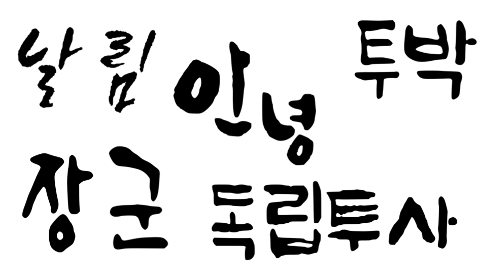

# 서예로봇, 서로

서로는 **인공지능**을 활용하여, *캘리그라피 작품*을 만들어주는 서비스입니다. 

캘리그라피를 따로 배우지 않아도, 이쁜 한글 글씨를 쉽게 가질 수 있습니다!

그리고 그 글씨는 포스터, 플랜카드, 썸네일, 로고 등 다양한 분야에 유용하게 쓰일 것입니다.

## 목차
1. Development Environment
2. AI
    1. Data Set
    2. Train
    3. Eval
    4. result
3. Web Service
    1. Front End
    2. Back End
4. Portfolio

# Development Environment
is|OS | Language|IDE
--|---|-----|---
Front End|Windows 10| JavaScript(ES6, ReactJS)|Visual Studio Code
Back End|Windows 10| Python 3.7(Flask Restful)|PyCharm JetBrain
DeepLearning|Windows 10| Python 3.7| Google Colab(GPU)

# AI
**서로**에 사용된 핵심 인공지능 기술입니다.
## 1. Data Set
서로는 다음과 같은 한글 조합서체 3종을 이용하여 학습합니다.

위 자모음을 각각 64x64의 크기로 나눕니다.

각 모델은 폰트, 음소별로 구분됩니다. ex) 투박체의 'ㄱ'만을 그릴 수 있게 학습

학습하기에 부족했던 데이터 량은 ImageDataGenerator를 통하여 보충합니다.

## 2. Train
./api/train.py 파일을 통해 학습합니다.

GAN 중에서도 InfoGan이라는 latant code를 통한 생성 이미지의 제어가 용이한 방법을 채택한 모델로서, Generator는 50의 normal noise와 3의 latant code를 Input으로 받아 64x64의 이미지로 확장하는 방법을 학습합니다.
## 3. Eval
./api/eval.py 파일을 통해 테스트합니다.

3자리의 latant code에 0부터 0.1씩 증가하여 1까지, 각각 총 10번의 다른 값을 넣어 이미지를 생성합니다.

## Result

# Web Service
**서로**는 웹을 통해 제공되는 서비스입니다.
## 1.Front End
React를 사용합니다.
React의 컴포넌트 구조는 페이지 또는 기능을 계층적으로 구성하고 용도에 맞추어 사용하기에 편리합니다.
또한 JSX라는 언어를 통해 순수 JS코드로 길어져야 할 코드를 HTML처럼 단순하게 작성할 수 있습니다.

## 2. Back End
Flask Restful을 사용합니다.
Flask Restful은 서버를 API형태로 짜기에 최적화된 모듈입니다.
요청 URL에 따라 Class를 나눔으로써 구조적인 코딩에 편리하다는 장점과 결정적으로 DeepLearning과 공통된 언어인 Python을 사용한다는 점에서 채택합니다.

# Portfolio
서로를 통해 만들어진 창작물입니다.

